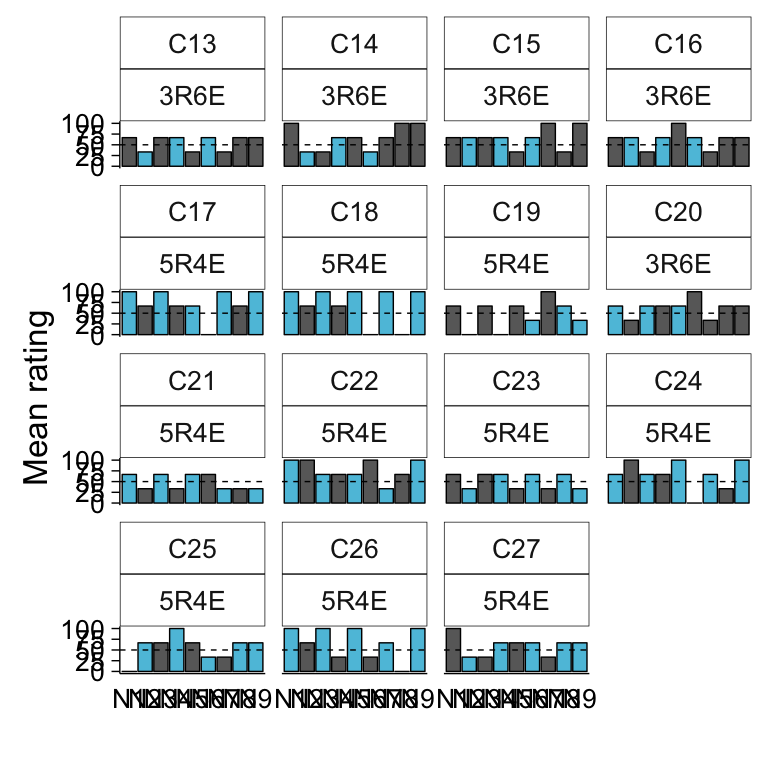
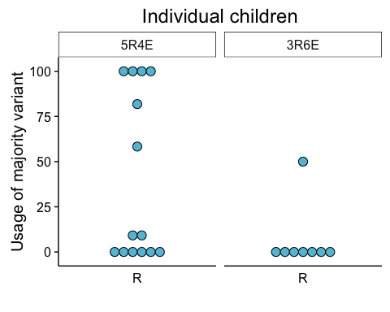
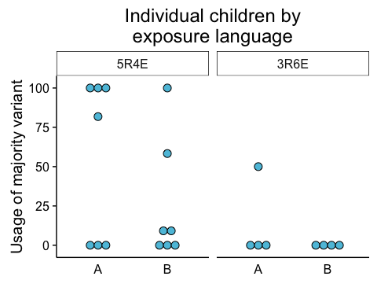
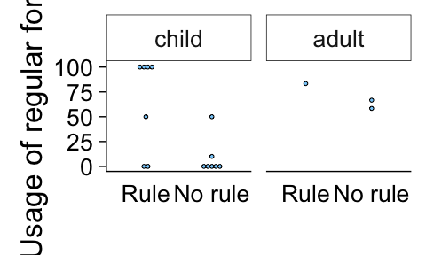
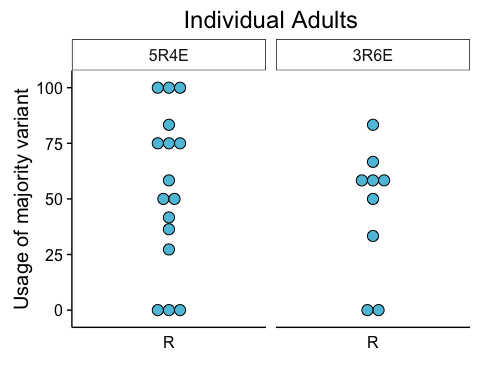
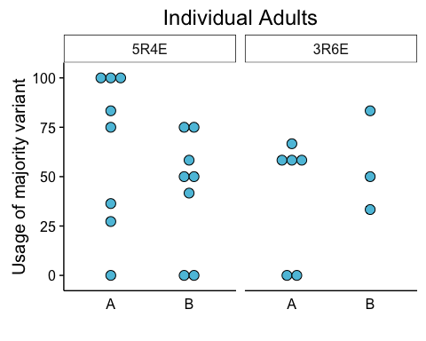

0164-empiricalyang-9noun-mfrule-tophalf-child
================
Kathryn Schuler
last updated 2016-12-05

-   [Introduction](#introduction)
-   [Materials and Method](#materials-and-method)
    -   [Subjects](#subjects)
    -   [Materials](#materials)
    -   [Procedure](#procedure)
-   [Results and analysis](#results-and-analysis)
    -   [Participants](#participants)
    -   [Data cleaning](#data-cleaning)
    -   [Production data](#production-data)

This experiment was conducted by Jessie Burke (summer research student), Kathryn Schuler (graduate student) and Elissa Newport (PI) and was based on a theory and computational model proposed by Charles Yang (U. Penn). The lab manager at the time of running was Jaclyn Horowitz. The data was collected at Georgetown University and DC metro area summer camps from June 14, 2016 to October, 25, 2016.

-   This experiment was reported in :
    -   2016 - CogSci presentation (but not the paper)
    -   2016 - BUCLD poster
-   And is planned to be reported in :
    -   2017- Katie's dissertation
    -   2017 - Open Mind paper

Introduction
============

The Tolerance Principle is a computational model that attempts to predict when a child will form a productive rule during language acquisition (Yang, 2016). The Tolerance Principle predicts accurately in corpus data and has also been shown to work in artificial languages (Yang, 2016). In previous artificial language studies, the Tolerance Principle successfully predicted productive rule formation when the regular form had the highest frequency, but it remains to be seen if frequency changes would still be accommodated within the model. Because the Tolerance Principle has been shown to work well in corpus data when the exceptions are randomly distributed in the top half (a language like condition), in this experiment we are testing whether this would hold true in artificial language learning. Using a paradigm that lowers the frequency of the regular form and increases the frequency of exceptions, we want to see if kids still form a productive rule despite the regular form not being the most frequent. We expect our results to either provide stronger evidence for the predictive power of the Tolerance Principle or to show where it fails and must be reconsidered. (abstract written by student Jessie Burke)

Materials and Method
====================

Subjects
--------

-   Adults:
    -   see [Participants](#participants) for demographic info
    -   native English speakers (but multilingual permitted)
    -   compensated $10
-   Children:
    -   see [Participants](#participants) for demographic info
    -   native English speakers (but multilingual permitted)
    -   compensated with a prize bag of small toys (and $10 if run in the lab)

Materials
---------

### Equipment

-   Hardware:
    -   Macbook Air (OSX)
    -   Sennheiser HD555 open-air headphones
    -   Internal microphone of Macbook Air
-   Software: Python, PsychoPy
    -   Note: Audacity used for some recordings as PsychoPy's microphone API unreliable

### Model

-   The Tolerance Principle (Yang, 2016)
-   Learners will form a productive rule when it is more computationally efficient
-   Let R be a rule that is applicable to N items, of which e are exceptions. R is productive iff: 
    -   $\\textrm{e} \\leq \\theta\_{9} \\quad \\textrm{where} \\quad \\theta\_{9} := \\frac{9}{ln(9)} = 4.096$
    -   
        $$\\textrm{e} \\leq \\theta\_{9}  \\quad \\textrm{where} \\quad  \\theta\_{9} := \\frac{9}{ln(9)} = 4.096$$

### Language

-   15 total nouns:
    -   9 familiar: `mawg`, `tombur`, `glim`, `zup`, `spad`, `daygin`, `flairb`, `clidam`, `lapal`
    -   6 novel: `bleggin`, `daffin`, `norg`, `sep`, `flugit`, `geed`
-   1 verb: `gentif` (means "there is" or "there are")
-   7 plural markers:
    -   1 regular form: `ka` (applied to most frequent nouns)
    -   6 exceptions: `po`, `lee`, `bae`, `tay`, `muy`, `woo`
-   Sentences constructed:
    -   Singular: `V` + `N` + `null` (e.g. `gentif mawg`)
    -   Plural: `V` + `N` + `MARKER` (e.g. `gentif mawg ka`)
-   Conditions:
    -   Compute the threshold for forming a productive rule by the Tolerance Principle (for our 9 nouns): 
        -   Thus, can tolerate 4 exceptions to the rule (regular form), but not 5 or more.
    -   5R4E Exposure: 5 types take the regular form `ka` and 4 remaining types take exceptions.
        -   Language A: The most frequent noun (`mawg`) in Zipfian distribution takes the regular form `ka`
            -   Token fq. of regular form = 63.27%
        -   Language B: The most frequent noun (`mawg`) in Zipfian distribution takes an exception
            -   Token fq. of regular form = 36.73%
    -   3R6E Exposure: 3 types take the regular form `ka` and 6 remaining types take exceptions.
        -   Language A: The most frequent noun (`mawg`) in Zipfian distribution takes the regular form `ka`
            -   Token fq. of regular form = 51.02%
        -   Language B: The most frequent noun (`mawg`) in Zipfian distribution takes an exception
            -   Token fq. of regular form = 30.61%

#### Stimuli

-   Images of "toasters" and pre-recorded words (adult female voice)
-   words recorded in isolation.
-   standard [editing](https://guide.kathrynschuler.com/guidelines/making-stimuli.html#how-to-edit-sounds) applied to recordings.
-   Exposure set:
    -   72 total sentences paired with corresponding picture
    -   each noun is paired with a specific plural marker (see [Language](#language))
    -   1/3 of presentations were singular and 2/3 plural for each noun
    -   plurals appeared in groups of 2, 4, or 6
    -   Zipfian distribution
-   Production test set:
    -   All novel nouns presented twice: `bleggin`, `daffin`, `norg`, `sep`, `flugit`, `geed`
    -   Once in groups of 3 and once in groups of 5
-   Rating test set:
    -   All 9 familiar nouns presented 4 times in 2AFC
        -   paired with four different incorrect plural markers

Procedure
---------

-   Exposure:
    -   see a picture and hear the sentence that goes with the picture
    -   repeat the sentence
    -   break every 18 trials (for sticker)
-   Production test:
    -   modeled after wug test (Berko, 1958)
    -   see a singular picture and hear corresponding sentence
    -   participant asked to produce plural sentence for same noun
-   Rating test:
    -   2AFC test in which there is a child in a purple shirt and a child in a green shirt on the screen.
    -   A test image appears in the box and the two cartoon children take turns producing a sentence to match the picture.
    -   participants must decide which child said the sentences correctly in silly speak

Results and analysis
====================

Participants
------------

### Included in analysis

The following describes the participants that were included in analysis by age group.

| age.group |  n.subjs|  n.female|  min.age|  max.age|   mean.age|     sd.age|
|:----------|--------:|---------:|--------:|--------:|----------:|----------:|
| adult     |       24|        20|    18.05|    25.43|  20.885417|  2.2256469|
| child     |       23|        12|     5.19|     7.82|   6.746956|  0.7857216|

The following describes the participants included in analysis further broken down by condition.

| age.group | condition |  n.subjs|  n.female|  min.age|  max.age|   mean.age|     sd.age|
|:----------|:----------|--------:|---------:|--------:|--------:|----------:|----------:|
| adult     | 3R6E      |       10|         8|    18.48|    25.43|  21.911000|  2.7932794|
| adult     | 5R4E      |       14|        12|    18.05|    22.51|  20.152857|  1.4054204|
| child     | 3R6E      |        8|         5|     5.19|     7.80|   6.695000|  0.8846630|
| child     | 5R4E      |       15|         7|     5.32|     7.82|   6.774667|  0.7592465|

### Excluded from analysis

The following describes participants that were excluded from analysis

| age.group |  n.subjs|  n.female|  min.age|  max.age|  mean.age|    sd.age|
|:----------|--------:|---------:|--------:|--------:|---------:|---------:|
| adult     |        6|         5|    18.49|    24.24|  20.57833|  2.123953|
| child     |        2|         1|     6.61|     6.91|   6.76000|  0.212132|

Details about excluded subjects are provided below. Reasons for exclusion are given in the notes.

| age.group | condition | subject | gender |    age| notes                                                       |
|:----------|:----------|:--------|:-------|------:|:------------------------------------------------------------|
| adult     | 3R6E      | S25     | female |  21.67| english not native language, she learned it in kindergarten |
| adult     | 5R4E      | S17     | female |  19.32| psychopy quit right before rating test began                |
| adult     | 5R4E      | S18     | female |  18.49| psychopy quit right before rating test began                |
| adult     | 5R4E      | S19     | female |  19.16| psychopy quit right before rating test began                |
| adult     | 5R4E      | S20     | male   |  24.24| psychopy quit right before rating test began                |
| adult     | 5R4E      | S21     | female |  20.59| psychopy quit during production test                        |
| child     | 3R6E      | C12     | male   |   6.91| not a native English speaker                                |
| child     | 5R4E      | C07     | female |   6.61| did not complete the study or produce any nouns             |

Data cleaning
-------------

For production data:

-   participant not included if excluded via KDS.exclude (too old, previous study version, etc)
-   participant not included if produces &lt; 50% nouns correct on production test (&gt;=6)
-   trial not included if participant does not produce the correct noun
-   analyze out of correct nouns

For rating data:

-   participant not included if completes &lt; 50% of rating trials
-   participant not included if rates every trial with the same value (all 5, all 1, etc)

Production data
---------------

For each production test trial, participants were asked to produce the plural form of a novel noun they heard only in a singular form. These novel productions allowed us to assess whether participants formed a productive rule. Recall that the Tolerance Principle predicts that there will be a categorical distinction between productive and unproductive (lexically specific) rules. In our artificial language, a productive rule should be formed if more than 4.096 nouns obey the rule (as in our 5 regular/4 exception condition), but not if fewer than 4.096 nouns do (as in our 3 regular/6 exception condition). When a productive rule is formed, it should be applied to 100% of novel nouns, as is the case for English past tense ‘add –ed.’.

To determine whether participants formed a productive rule, we performed a one-tailed t-test against the hypothesized value of 100%. Participants who have formed a productive rule should, according to the Tolerance Principle, mark these novel plural sentences with ka 100% of the time. On the other hand, participants who have not formed a productive rule should use the ka inflection significantly less than 100% (and perhaps no more frequently than other inflection forms are used).

We ask the folowing questions in our analysis (for both children and adults):

-   Does the Tolerance Principle predict when learners will generalize the majority variant?
    -   Do learners use the majority variant on 100% of test trials (form a productive rule)?
    -   Or do learners use the majority variant on no more than what we expect by chance (strongly resist generalization)?
    -   Or do learners match the input frequency of the majority variant (probability match)?

### Group data

What is the percent usage of markers (R, e, null, other) by condition for each age group?

| Age   | Condition | Marker |    N|      Mean|        SD|        SEM|
|:------|:----------|:-------|----:|---------:|---------:|----------:|
| child | 5R4E      | R      |   14|  39.89177|  46.39918|  12.400701|
| child | 3R6E      | R      |    8|   6.25000|  17.67767|   6.250000|
| adult | 5R4E      | R      |   16|  54.49811|  35.12241|   8.780602|
| adult | 3R6E      | R      |    9|  45.37037|  28.90091|   9.633635|

#### Plots of child data

The dashed red line indicates the frequency of the majority form in the learner's exposure.









``` r
# plot the mean percent usage by age.group and condition
# mmkid <- filter(mean.marker.usage, age.group == "child")
# 
# ggplot(mmkid, aes(x = categoryDet, y = mean.pcntusage, fill = categoryDet)) +
#     facet_grid(. ~ condition.y) +
#     geom_bar(stat = "identity", position = position_dodge(), color = "black") +
#     geom_errorbar(aes(ymin = mean.pcntusage - std.error, ymax = mean.pcntusage + std.error),
#                   position = position_dodge(width = 0.9), width = 0.25) +
#    scale_fill_manual(values=c("#5dc2dd", "#696969", "#A9A9A9", "#D3D3D3"))+
#     coord_cartesian(ylim = c(0, 101)) +
#     xlab("") +
#     ylab("Usage of plural marker") +
#     theme(legend.position = "none")
# 
# ggplot(mean.marker.usage.lang, aes(x = condition.y, y = mean.pcntusage, fill = categoryDet)) +
#     facet_grid(language ~ age.group) +
#     geom_bar(stat = "identity", position = position_dodge(), color = "black") +
#     geom_errorbar(aes(ymin = mean.pcntusage - std.error, ymax = mean.pcntusage + std.error),
#                   position = position_dodge(width = 0.9), width = 0.25) +
#     geom_hline(yintercept = 67, linetype = "dashed") +
#     coord_cartesian(ylim = c(0, 101)) +
#     xlab("") +
#     ylab("Usage of plural marker") +
#     ggtitle("Overall") +
#     theme(legend.title = element_blank())
# 
# # get the percent usages by subject by age.group by condition by category (maj/min)
# indie.marker.usage <- group_by(prod.clean, subject, condition.y, age.group, categoryDet, n.correct.nouns) %>%
#   summarise(count = n()) %>%
#   as.data.frame %>%
#   complete(nesting(age.group, condition.y, subject, n.correct.nouns), categoryDet, fill = list(count = 0)) %>%
#   mutate(pcntusage = count/n.correct.nouns *100) %>% filter(categoryDet == "R")
# 
# 
# ggplot(indie.marker.usage, aes(x = condition.y, y = pcntusage)) +
#   facet_grid(. ~ age.group) +
#   geom_dotplot(binaxis = "y", stackdir = "center", binwidth = 4, fill = "lightskyblue") +
#   stat_summary(fun.data = mean_se, geom = "errorbar", width = 0.5) +
#   coord_cartesian(ylim = c(0, 101)) +
#   xlab("") +
#   ylab("Usage of regular form") 
# 
# indie.marker.usage <- group_by(prod.clean, subject, condition.y, language, age.group, categoryDet, n.correct.nouns) %>%
#   summarise(count = n()) %>%
#   as.data.frame %>%
#   complete(nesting(age.group, condition.y, language, subject, n.correct.nouns), categoryDet, fill = list(count = 0)) %>%
#   mutate(pcntusage = count/n.correct.nouns *100) %>% filter(categoryDet == "R")
# 
# 
# ggplot(indie.marker.usage, aes(x = condition.y, y = pcntusage)) +
#   facet_grid(language ~ age.group) +
#   geom_dotplot(binaxis = "y", stackdir = "center", binwidth = 6, fill = "lightskyblue") +
#   coord_cartesian(ylim = c(0, 101)) +
#   xlab("") +
#   ylab("Usage of regular form") 
# 
```

### Rating data

``` r
# # reorder levels of factors
# rate.clean.v123$age.group <- factor(rate.clean.v123$age.group, levels = c("child", "adult"))
# rate.clean.v123$condition.y <- factor(rate.clean.v123$condition.y, levels = c("5R4E", "3R6E"))
# rate.clean.v123$cat <- factor(rate.clean.v123$cat, levels = c("R", "e"))
# 
# # get the results for yes/no rating test (version12)
# mean.rate.v12 <- filter(rate.clean.v123, exp.version %in% c("v1", "v2")) %>%
#   mutate(typemod = ifelse(type == "correct", 1, 0),
#     iscorrect = ifelse(typemod == rating, 1, 0)) %>%
#   group_by(age.group, condition.y, language, subject, noun, cat) %>%
#   summarise(count = n(), corrsum = sum(iscorrect)) %>%
#   mutate(pcntcorr = corrsum/count*100) %>%
#   group_by(age.group, condition.y, language, noun, cat) %>%
#   summarise(mean.pcntcorr = mean(pcntcorr), std.error = SEM(pcntcorr))
# 
# # uncomment to get a table of the results
# # mean.rate.v12 %>% as.data.frame %>% kable
# 
# ggplot(mean.rate.v12, aes(x = condition.y, y = mean.pcntcorr, fill = noun)) +
#   facet_grid(age.group~language) +
#   geom_bar(stat = "identity", position = position_dodge(), color = "black") +
#   geom_errorbar(aes(ymin = mean.pcntcorr - std.error, ymax = mean.pcntcorr + std.error),
#                 position = position_dodge(width = 0.9), width = 0.25) +
#   coord_cartesian(ylim = c(0, 101)) +
#   xlab("") +
#   ylab("Mean rating")
```

``` r
# get the results for 1-5 scale rating test (version 3)
# mean.rate.v3 <- filter(rate.clean.v123, exp.version %in% c("v3")) %>%
#   group_by(age.group, condition.y, language, subject, cat) %>%
#   summarise(count = n(), mean.rate = mean(rating)) %>%
#   group_by(age.group, condition.y, language, cat) %>%
#   summarise(n.subjs = n(), avg.mean.rate = mean(mean.rate), std.error = SEM(mean.rate))

# uncomment to get a table of the results
# mean.rate.v3 %>% as.data.frame %>% kable
# 
# ggplot(mean.rate.v3, aes(x = condition.y, y = avg.mean.rate, fill = cat)) +
#   facet_grid(.~age.group) +
#   geom_bar(stat = "identity", position = position_dodge(), color = "black") +
#   geom_errorbar(aes(ymin = avg.mean.rate - std.error, ymax = avg.mean.rate + std.error),
#                 position = position_dodge(width = 0.9), width = 0.25) +
#   coord_cartesian(ylim = c(1, 5)) +
#   xlab("") +
#   ylab("Mean rating")
# ```
# 
# ```{r, echo=TRUE, fig.width=8, fig.height=8}
# 
# # get the results for 1-5 scale rating test (version 3)
# mean.rate.v4 <- mutate(rate.data.v4, iscorrect = ifelse(rating == whichCorrect, 1, 0)) %>%
#   group_by(age.group, condition.y, language, subject, corr.det.cat,noun.rank) %>%
#   summarise(count = n(), n.corr = sum(iscorrect), pcntcorr = n.corr/count*100) %>% print
#   # group_by(age.group, condition.y, language, corr.det.cat, noun.rank) %>%
#   # summarise(n.subjs = n(), avg.pcntcorr = mean(pcntcorr), std.error = SEM(pcntcorr))
# 
# # uncomment to get a table of the results
# # mean.rate.v4 %>% as.data.frame %>% kable
# 
# 
# mean.rate.v4.kids <- filter(mean.rate.v4, age.group == "child")
# mean.rate.v4.adults <- filter(mean.rate.v4, age.group == "adult")
# 
# 
# 
# 
# 
# ggplot(mean.rate.v4.kids, aes(x = noun.rank, y = pcntcorr, fill = corr.det.cat)) +
#   facet_wrap(subject ~ condition.y) +
#   geom_bar(stat = "identity", position = position_dodge(), color = "black") +
#   # geom_errorbar(aes(ymin = pcntcorr - std.error, ymax = pcntcorr + std.error),
#   #               position = position_dodge(width = 0.9), width = 0.25) +
#   geom_hline(yintercept = 50, linetype = "dashed") +
#   coord_cartesian(ylim = c(0, 100)) +
#   xlab("") +
#   ylab("Mean rating") +
#   scale_fill_manual(values=c("#696969", "#5dc2dd"))+
#   theme(legend.position = "none")
# 
# 
# c17 <- filter(mean.rate.v4.kids, subject == "C17")
# c22 <- filter(mean.rate.v4.kids, subject == "C22")
# 
# ggplot(c17, aes(x = noun.rank, y = pcntcorr, fill = corr.det.cat)) +
#   facet_wrap(~subject) +
#   geom_bar(stat = "identity", position = position_dodge(), color = "black") +
#   # geom_errorbar(aes(ymin = pcntcorr - std.error, ymax = pcntcorr + std.error),
#   #               position = position_dodge(width = 0.9), width = 0.25) +
#   geom_hline(yintercept = 50, linetype = "dashed") +
#   coord_cartesian(ylim = c(0, 100)) +
#   xlab("") +
#   ylab("Proportion correct") +
#   scale_fill_manual(values=c("#696969", "#5dc2dd"))+
#   theme(legend.position = "none")
# ggsave('/Users/kathrynschuler/Desktop/pentalk-3.png', width=6, height=4)
# 
# 
# ggplot(c22, aes(x = noun.rank, y = pcntcorr, fill = corr.det.cat)) +
#   facet_wrap(~subject) +
#   geom_bar(stat = "identity", position = position_dodge(), color = "black") +
#   # geom_errorbar(aes(ymin = pcntcorr - std.error, ymax = pcntcorr + std.error),
#   #               position = position_dodge(width = 0.9), width = 0.25) +
#   geom_hline(yintercept = 50, linetype = "dashed") +
#   coord_cartesian(ylim = c(0, 100)) +
#   xlab("") +
#   ylab("Proportion correct") +
#   scale_fill_manual(values=c("#696969", "#5dc2dd"))+
#   theme(legend.position = "none")
# ggsave('/Users/kathrynschuler/Desktop/pentalk-4.png', width=6, height=4)
# 
# 
# 
# ```
# 
# ```{r fig.width = 8, fig.height = 8}
# rate.eln.a <- group_by(mean.rate.v4.kids, condition.y, subject) %>%
#   summarise(mean.corr = mean(pcntcorr))%>%
#   select(condition.y, subject, mean.corr)
# 
# 
# 
# rate.eln.a %>% as.data.frame %>% kable
# 
# rate.eln.b <- group_by(mean.rate.v4.kids, condition.y, subject, corr.det.cat) %>%
#   summarise(mean.corr = mean(pcntcorr))%>%
#   select(condition.y, subject, corr.det.cat, mean.corr) %>%
#   spread(corr.det.cat, mean.corr)
# 
# rate.eln.a %>% as.data.frame %>% kable
# 
# 
# rate.eln <- group_by(mean.rate.v4.kids, condition.y, subject, corr.det.cat) %>%
#   summarise(mean.corr = mean(pcntcorr)) %>% 
#   select(condition.y, subject, corr.det.cat, mean.corr) %>%
#   spread(corr.det.cat, mean.corr) %>%
#   filter(e > 62 | R > 62) 
# 
# # rate.eln$corr.det.cat <- factor(rate.eln$corr.det.cat, levels = c("R", "e")) 
# 
# 
# 
# 
# rate.eln %>% as.data.frame %>% kable
# 

# ggplot(rate.eln, aes(x = corr.det.cat, y = mean.corr, fill = corr.det.cat)) +
#   facet_wrap(condition.y ~ subject)+
#   geom_bar(stat = "identity", position = position_dodge(), color = "black", width = 0.5)+
#   geom_hline(yintercept = 50, linetype = "dashed") +
#   coord_cartesian(ylim = c(0, 100)) +
#   xlab("") +
#   ylab("Mean proportion correct") +
#   scale_fill_manual(values=c("#5dc2dd", "#696969"))+
#   theme(legend.position = "none")
```

``` r
# prod.clean.v4 <- filter(prod.clean, exp.version == "v4")
# 
# indie.TP.calc <- mutate(mean.rate.v4, known = ifelse(pcntcorr > 50.0, 1, 0)) %>%
#   group_by(age.group, language, condition.y, subject, corr.det.cat) %>%
#   summarise(n.know = sum(known)) %>% 
#   spread(corr.det.cat, n.know) %>%
#   mutate(new.n = e + R, new.TP = new.n/log(new.n), 
#          new.TP.predicts = ifelse(e < new.TP, "Rule", "No rule")) 
# 
# prod.clean.v4.newTP <- group_by(prod.clean.v4, age.group, language, condition.y, subject, categoryDet, n.correct.nouns) %>%
#   summarise(count = n()) %>%
#   as.data.frame %>%
#   complete(nesting(age.group, language, condition.y, subject, n.correct.nouns), categoryDet, fill = list(count = 0)) %>%
#   mutate(pcntusage = count/n.correct.nouns *100) %>% filter(categoryDet == "R") %>%
#   left_join(indie.TP.calc, by = c("age.group", "language", "condition.y", "subject")) %>%
#   print
# 
# # reorder levels of factors into the order we want
# prod.clean.v4.newTP$age.group <- factor(prod.clean.v4.newTP$age.group, levels = c("child", "adult"))
# prod.clean.v4.newTP$condition.y <- factor(prod.clean.v4.newTP$condition.y, levels = c("5R4E", "3R6E"))
# prod.clean.v4.newTP$new.TP.predicts <- factor(prod.clean.v4.newTP$new.TP.predicts, levels = c("Rule", "No rule"))
# 
# prod.clean.v4.newTP %>% as.data.frame %>% kable
# 
# ggplot(prod.clean.v4.newTP, aes(x = new.TP.predicts, y = pcntusage)) +
#   facet_grid(. ~ age.group) +
#   geom_dotplot(binaxis = "y", stackdir = "center", binwidth = 4, fill = "lightskyblue") +
#   coord_cartesian(ylim = c(0, 101)) +
#   xlab("") +
#   ylab("Usage of regular form")
# prod.clean.v4.newTP <- mutate(prod.clean.v4.newTP, exp.name = "Experiment 2") %>%
#   filter(subject %in% c("C14", "C15","C16", "C20", "C17", "C18", "C19", "C22", "C24","C25", "C26"))
# 
# ```
# 
# ```{r fig.height = 4, fig.width = 3}
# ggplot(filter(prod.clean.v4.newTP, age.group =="child"), aes(x = new.TP.predicts, y = pcntusage)) +
#   facet_grid(. ~ exp.name) +
#   geom_dotplot(binaxis = "y", stackdir = "center", binwidth = 6, fill = "lightskyblue") +
#   # stat_summary(fun.data = mean_se, geom = "errorbar", width = 0.5) +
#   coord_cartesian(ylim = c(0, 101)) +
#   xlab("") +
#   ylab("Usage of regular form") 
# ggsave('/Users/kathrynschuler/Desktop/pentalk-5.png', width=6, height=4)
# ```
# 
# ```{r}
# 
# ggplot(prod.clean.v4.newTP, aes(x = condition.y, y = pcntusage)) +
#   facet_grid(. ~ age.group) +
#   geom_dotplot(binaxis = "y", stackdir = "center", binwidth = 4, fill = "lightskyblue") +
#   coord_cartesian(ylim = c(0, 101)) +
#   xlab("") +
#   ylab("Usage of regular form") 
# 
# 
# prod.clean.v4.newTP %>%
#   select(age.group, language, condition.y, subject, e, R, new.n, new.TP, new.TP.predicts, pcntusage) %>%
#   as.data.frame %>% kable
# 
# newTP.prop.correct <- mutate(prod.clean.v4.newTP, personalTP = ifelse(new.TP.predicts == "Rule",
#                                                          ifelse(pcntusage > 75.0, 1, 0), ifelse(pcntusage < 25.0, 1, 0))) %>%
#   mutate(groupTP = ifelse(condition.y == "5R4E", ifelse(pcntusage > 75.0, 1, 0), ifelse(pcntusage < 25.0, 1, 0))) %>%
#   group_by(age.group, condition.y) %>%
#   summarise(count = n(), acc.personalTP = sum(personalTP)/count *100, acc.groupTP = sum(groupTP)/count*100) %>% print
# 
# 
# # newTP.prop.eln <- (prod.clean.v4.newTP)
# #   group_by(condition.y, subject) %>%
# #   summarise(count = n(), acc.personalTP = sum(personalTP)/count *100, acc.groupTP = sum(groupTP)/count*100) %>% print
# # 
# 
# 
# 
# 
# acc.plot.data <- filter(newTP.prop.correct, age.group == "child") %>%
#   gather(whichTP, accuracy, acc.personalTP:acc.groupTP) %>% print
# 
# acc.plot.data$whichTP <- factor(acc.plot.data$whichTP, labels = c("9/ln(9)", "Personal TP"))
# ggplot(acc.plot.data, aes(x = whichTP, y = accuracy, fill = whichTP)) +
#   facet_grid(.~condition.y)+
#    geom_bar(stat= "identity", position = position_dodge(), color = "black", width = .50) +
# 
#   theme(legend.position = "none") +
#   coord_cartesian(ylim = c(0, 100)) +
#   ylab("Prediction accuracy")+
#   xlab("")
# 
# # get the percent usages by subject by age.group by condition by category (maj/min)
# indie.marker.usage <- group_by(prod.clean, subject, condition.y, age.group, categoryDet, n.correct.nouns) %>%
#   summarise(count = n()) %>%
#   as.data.frame %>%
#   complete(nesting(age.group, condition.y, subject, n.correct.nouns), categoryDet, fill = list(count = 0)) %>%
#   mutate(pcntusage = count/n.correct.nouns *100) %>% filter(categoryDet == "R")
# 
# ggkid <- filter(indie.marker.usage, age.group == "child")
# 
# ggplot(ggkid, aes(x = condition.y, y = pcntusage)) +
#   geom_rect(xmin = -Inf, xmax = Inf, ymin = 85, ymax = Inf, colour = "darkseagreen1", fill ="darkseagreen1")+
#   geom_rect(xmin = -Inf, xmax = Inf, ymin = -Inf, ymax = 15, colour = "pink1", fill ="pink1" )+
# 
#   geom_bar(stat= "identity", position = position_dodge(), color = "black") +
#   #stat_summary(fun.data = mean_se, geom = "errorbar", width = 0.5) +
#   coord_cartesian(ylim = c(0, 101)) +
#   xlab("") +
#   ylab("Usage of regular form") 
```

``` r
#install.packages("permute", repos='http://cran.us.r-project.org')
# library(permute)
# # take prod.clean.v4.newTP$pcntusage and shuffle it
# sample(prod.clean.v4.newTP$pcntusage)
# print(select(prod.clean.v4.newTP, age.group, condition.y, subject, pcntusage, new.TP.predicts))
```
