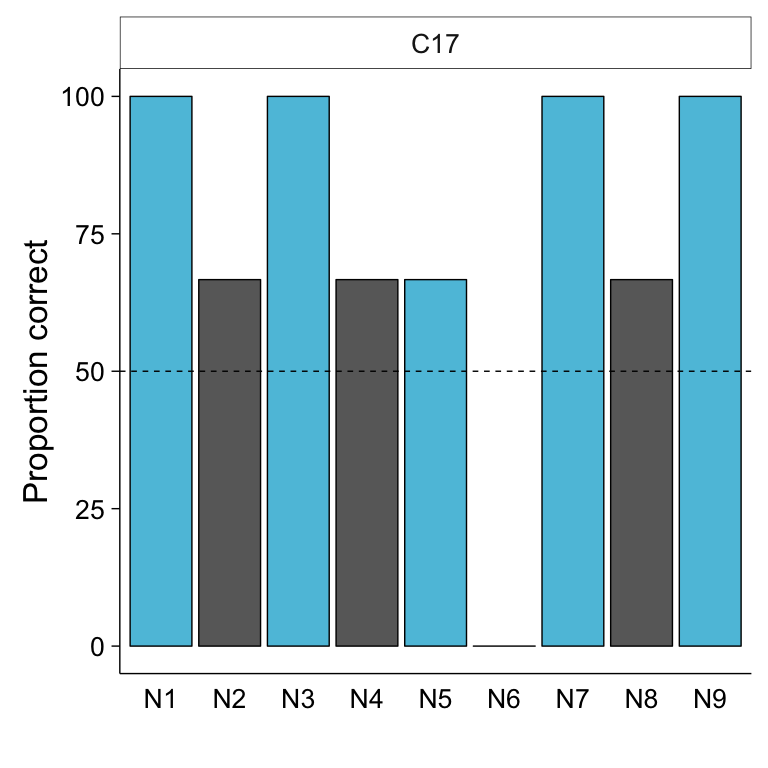

0164-empiricalyang-9noun-mfrule-tophalf-child
================
Kathryn Schuler
last updated 2016-12-05

-   [Introduction](#introduction)
-   [Materials and Method](#materials-and-method)
-   [Results and analysis](#results-and-analysis)

This experiment was conducted by Jessie Burke (summer research student), Kathryn Schuler (graduate student) and Elissa Newport (advisor). The lab manager at the time of running was Jaclyn Horowitz. The data was collected at Georgetown University and DC metro area summer camps from June 14, 2016 to October, 25, 2016.

-   This experiment was reported in :
    -   2016 - CogSci presentation (but not the paper)
    -   2016 - BUCLD poster
-   And is planned to be reported in :
    -   2017- Katie's dissertation
    -   2017 - Open Mind paper

Introduction
------------

The Tolerance Principle is a computational model that attempts to predict when a child will form a productive rule during language acquisition (Yang, 2016). The Tolerance Principle predicts accurately in corpus data and has also been shown to work in artificial languages (Yang, 2016). In previous artificial language studies, the Tolerance Principle successfully predicted productive rule formation when the regular form had the highest frequency, but it remains to be seen if frequency changes would still be accommodated within the model. Because the Tolerance Principle has been shown to work well in corpus data when the exceptions are randomly distributed in the top half (a language like condition), in this experiment we are testing whether this would hold true in artificial language learning. Using a paradigm that lowers the frequency of the regular form and increases the frequency of exceptions, we want to see if kids still form a productive rule despite the regular form not being the most frequent. We expect our results to either provide stronger evidence for the predictive power of the Tolerance Principle or to show where it fails and must be reconsidered. (abstrat written by student Jessie Burke)

Materials and Method
--------------------

### Subjects

-   Adults:
    -   XX GU undergrads | X male, X female (X excluded)
    -   compensated $10
-   Children:
    -   XX children recruited from XX | X male, X female (X excluded)
    -   compensated with a prize bag of small toys (and $10 if run in the lab)

### Materials

#### Equipment

-   Hardware:
    -   Macbook Air
    -   Sennheiser HD555 open-air headphones
    -   Internal microphone of Macbook Air
-   Software: Python, PsychoPy

#### Language

-   15 total nouns: (9 familiar) `mawg`, `tombur`, `glim`, `zup`, `spad`, `daygin`, `flairb`, `clidam`, `lepal`, (6 novel) `bleggin`, `daffin`, `norg`, `sep`, `flugit`, `geed`
-   1 verb: `gentif`, means "there is" or "there are"
-   7 plural markers: (1 regular)`ka`, (6 exceptions) `po`, `lee`, `bae`, `tay`, `muy`, `woo`
-   Sentences constructed:
    -   Singular: `V` + `N` + `null` (e.g. `gentif mawg`)
    -   Plural: `V` + `N` + `MARKER` (e.g. `gentif mawg ka`)
-   Conditions:
    -   5R4E Exposure: regular form 'ka' occurs 5 times and exceptions occur 4 times
        -   Exposure A : regular form 'ka' occurs at the highest frequency
        -   Exposure B : exception 'po' occurs at the highest frequency
    -   3R6E Exposure: regular form 'ka' occurs 3 times and exceptions occur 6 times
        -   Exposure A: regular form 'ka' occurs at the highest frequency
        -   Exposure B: exception 'po' occurs at the highest frequency

#### Stimuli

-   Images of "toasters" and pre-recorded words (adult female voice)
-   Exposure set:
    -   72 total sentences paired with corresponding picture
    -   each noun is paired with its own specific marker and appears at varying frequencies across conditions
    -   1/3 of presentations were singular and 2/3 plural for each noun
    -   plurals appeared in groups of 2, 4, or 6
    -   Zipfian distribution
-   Test set:
    -   All novel nouns presented once: `bleggin`, `daffin`, `norg`, `sep`, `flugit`, `geed`
    -   plurals appeared in groups of 3 or 5

### Procedure

-   Exposure:
    -   see a picture and hear the sentence that goes with the picture
    -   repeat the sentence
    -   break every 24 trials (for sticker)
-   Production test:
    -   modeled after wug test (Berko, 1958)
    -   see a singular picture and hear corresponding sentence
    -   participant asked to produce plural sentence for same noun
-   Rating test:
    -   see picture and hear corresponding sentence
    -   rate on a scale of 1 to 5 (give 1 to 5 stars)

Results and analysis
--------------------

### Setting up

We begin by loading the required packages, setting up some figure parameters, and specifying file paths.

Then we load the data.

``` r
lexicon <- fread(paste(DATA_PATH, '/0164-lexicon-key.csv', sep="")) %>% 
  tbl_df


# Import subject tracking sheet
subjects <- fread(SUBJ_TRACK) %>%
  tbl_df

# Import and combine subject production data and merge with subject tracking
prod.data <- list.files(paste(DATA_PATH, '/production-coder-madi/production', sep=""), full.names = TRUE) %>%
    lapply(fread) %>%
    bind_rows %>%
    tbl_df %>%
    left_join(subjects, by ="subject") 

# Import and combine subject rating data and merge with subject tracking
rate.data.v123 <- list.files(paste(DATA_PATH, '/rating-v123', sep=""), full.names = TRUE) %>%
    lapply(fread) %>%
    bind_rows %>%
    tbl_df %>%
    left_join(subjects, by ="subject")

# Import and combine subject rating data and merge with subject tracking
rate.data.v4 <- list.files(paste(DATA_PATH, '/rating-v4', sep=""), full.names = TRUE) %>%
    lapply(fread) %>%
    bind_rows %>%
    tbl_df %>%
    left_join(subjects, by ="subject") %>%
    left_join(lexicon, by = c("condition.x", "noun"))
```

### Data cleaning

For production data:

-   participant not included if excluded via KDS.exclude (too old, previous study version, etc)
-   participant not included if produces &lt; 50% nouns correct on production test (&gt;=6)
-   trial not included if participant does not produce the correct noun
-   analyze out of correct nouns

For rating data: - participant not included if complets &lt; 50% of rating trials - participant not included if rates every trial with the same value (all 5, all 1, etc)

``` r
# calculate the criteria above for production data
prod.criteria <- group_by(prod.data, subject, condition.y) %>%
  summarise(totaltrials = n(), n.correct.nouns = sum(corrNoun))

# calculate the criteria above for rating data
rate.criteria.v123 <- group_by(rate.data.v123, subject, condition.y) %>%
  summarise(totaltrials = n(), n.distinct.answers = n_distinct(rating))

rate.criteria.v4 <- group_by(rate.data.v4, subject, condition.y) %>%
  summarise(totaltrials = n(), n.distinct.answers = n_distinct(rating))

# uncomment to see these critera in a summary table
# prod.criteria %>% as.data.frame %>% kable
# rate.criteria %>% as.data.frame %>% kable

# remove participants and trials that do not meet criteria for production
prod.clean <- left_join(prod.data, prod.criteria, by = c("subject", "condition.y")) %>%
  filter(KDS.exclude != 1, n.correct.nouns >= 6, corrNoun == 1)

# remove participants and trials that do not meet criteria for rating
rate.clean.v123 <- left_join(rate.data.v123, rate.criteria.v123, by = c("subject", "condition.y")) %>%
  filter(KDS.exclude != 1, totaltrials >=6, n.distinct.answers > 1)

rate.clean.v4 <- left_join(rate.data.v4, rate.criteria.v4, by = c("subject", "condition.y")) %>%
  filter(KDS.exclude != 1, totaltrials >=6, n.distinct.answers > 1)
```

### Demographic Data

### Production data

For each production test trial, participants were asked to produce the plural form of a novel noun they heard only in a singular form. These novel productions allowed us to assess whether participants formed a productive rule. Recall that the Tolerance Principle predicts that there will be a categorical distinction between productive and unproductive (lexically specific) rules. In our artificial language, a productive rule should be formed if more than 4.096 nouns obey the rule (as in our 5 regular/4 exception condition), but not if fewer than 4.096 nouns do (as in our 3 regular/6 exception condition). When a productive rule is formed, it should be applied to 100% of novel nouns, as is the case for English past tense ‘add –ed.’.

To determine whether participants formed a productive rule, we performed a one-tailed t-test against the hypothesized value of 100%. Participants who have formed a productive rule should, according to the Tolerance Principle, mark these novel plural sentences with ka 100% of the time. On the other hand, participants who have not formed a productive rule should use the ka inflection significantly less than 100% (and perhaps no more frequently than other inflection forms are used).

#### Data Analysis

What is the percent majority determiner usage by age group?

``` r
# reorder levels of factors into the order we want
prod.clean$age.group <- factor(prod.clean$age.group, levels = c("child", "adult"))
prod.clean$condition.y <- factor(prod.clean$condition.y, levels = c("5R4E", "3R6E"))
prod.clean$categoryDet <- factor(prod.clean$categoryDet, levels = c("R", "e", "null", "other"))

# get the percent usages by subject by age.group by condition by category (maj/min)
mean.marker.usage <- group_by(prod.clean, subject, condition.y, age.group, categoryDet, n.correct.nouns) %>%
  summarise(count = n()) %>%
  as.data.frame %>%
  complete(nesting(age.group, condition.y, subject, n.correct.nouns), categoryDet, fill = list(count = 0)) %>%
  mutate(pcntusage = count/n.correct.nouns *100) %>% as.data.frame %>%
  group_by(age.group, condition.y, categoryDet) %>%
  summarise(n.subj = n_distinct(subject), mean.pcntusage = mean(pcntusage), std.error = SEM(pcntusage))

mean.marker.usage.lang <- group_by(prod.clean, subject, condition.y, language, age.group, categoryDet, n.correct.nouns) %>%
  summarise(count = n()) %>%
  as.data.frame %>%
  complete(nesting(age.group, condition.y, language, subject, n.correct.nouns), categoryDet, fill = list(count = 0)) %>%
  mutate(pcntusage = count/n.correct.nouns *100) %>% as.data.frame %>%
  group_by(age.group, condition.y, language, categoryDet) %>%
  summarise(n.subj = n_distinct(subject), mean.pcntusage = mean(pcntusage), std.error = SEM(pcntusage))
# print it as a pretty table
#mean.marker.usage %>% as.data.frame %>% kable

# ttest for mean.marker.usage %>% filter(categoryDet == "maj") %>%
# mean.marker.usage.t <- group_by(prod.clean, subject, condition.y, age.group, categoryDet, n.correct.nouns) %>%
#   summarise(count = n()) %>%
#   as.data.frame %>%
#   complete(nesting(age.group, condition.y, subject, n.correct.nouns), categoryDet, fill = list(count = 0)) %>%
#   mutate(pcntusage = count/n.correct.nouns *100)

# adult.pureincon <- filter(mean.marker.usage.t, age.group == "adult", condition.y == "PureIncon", categoryDet == "maj")
# child.pureincon <- filter(mean.marker.usage.t, age.group == "child", condition.y == "PureIncon", categoryDet == "maj")
# child.purecond <- filter(mean.marker.usage.t, age.group == "child", condition.y == "PureCond", categoryDet == "maj")
# t.test(adult.pureincon$pcntusage, alternative = "greater", mu = 65.0)
# t.test(child.pureincon$pcntusage, alternative = "greater", mu = 65.0)
# t.test(child.purecond$pcntusage, alternative = "greater", mu = 65.0)
# 
# t.test(pcntusage, alternative = "two.sided", mu = 65.0)$p.value)
```

Plot the results as individual dotplot.

``` r
# plot the mean percent usage by age.group and condition
mmkid <- filter(mean.marker.usage, age.group == "child")

ggplot(mmkid, aes(x = categoryDet, y = mean.pcntusage, fill = categoryDet)) +
    facet_grid(. ~ condition.y) +
    geom_bar(stat = "identity", position = position_dodge(), color = "black") +
    geom_errorbar(aes(ymin = mean.pcntusage - std.error, ymax = mean.pcntusage + std.error),
                  position = position_dodge(width = 0.9), width = 0.25) +
   scale_fill_manual(values=c("#5dc2dd", "#696969", "#A9A9A9", "#D3D3D3"))+
    coord_cartesian(ylim = c(0, 101)) +
    xlab("") +
    ylab("Usage of plural marker") +
    theme(legend.position = "none")
```


``` r
ggplot(mean.marker.usage.lang, aes(x = condition.y, y = mean.pcntusage, fill = categoryDet)) +
    facet_grid(language ~ age.group) +
    geom_bar(stat = "identity", position = position_dodge(), color = "black") +
    geom_errorbar(aes(ymin = mean.pcntusage - std.error, ymax = mean.pcntusage + std.error),
                  position = position_dodge(width = 0.9), width = 0.25) +
    geom_hline(yintercept = 67, linetype = "dashed") +
    coord_cartesian(ylim = c(0, 101)) +
    xlab("") +
    ylab("Usage of plural marker") +
    ggtitle("Overall") +
    theme(legend.title = element_blank())
```


``` r
# get the percent usages by subject by age.group by condition by category (maj/min)
indie.marker.usage <- group_by(prod.clean, subject, condition.y, age.group, categoryDet, n.correct.nouns) %>%
  summarise(count = n()) %>%
  as.data.frame %>%
  complete(nesting(age.group, condition.y, subject, n.correct.nouns), categoryDet, fill = list(count = 0)) %>%
  mutate(pcntusage = count/n.correct.nouns *100) %>% filter(categoryDet == "R")


ggplot(indie.marker.usage, aes(x = condition.y, y = pcntusage)) +
  facet_grid(. ~ age.group) +
  geom_dotplot(binaxis = "y", stackdir = "center", binwidth = 4, fill = "lightskyblue") +
  stat_summary(fun.data = mean_se, geom = "errorbar", width = 0.5) +
  coord_cartesian(ylim = c(0, 101)) +
  xlab("") +
  ylab("Usage of regular form") 
```


``` r
indie.marker.usage <- group_by(prod.clean, subject, condition.y, language, age.group, categoryDet, n.correct.nouns) %>%
  summarise(count = n()) %>%
  as.data.frame %>%
  complete(nesting(age.group, condition.y, language, subject, n.correct.nouns), categoryDet, fill = list(count = 0)) %>%
  mutate(pcntusage = count/n.correct.nouns *100) %>% filter(categoryDet == "R")


ggplot(indie.marker.usage, aes(x = condition.y, y = pcntusage)) +
  facet_grid(language ~ age.group) +
  geom_dotplot(binaxis = "y", stackdir = "center", binwidth = 6, fill = "lightskyblue") +
  coord_cartesian(ylim = c(0, 101)) +
  xlab("") +
  ylab("Usage of regular form") 
```


### Rating data

``` r
# reorder levels of factors
rate.clean.v123$age.group <- factor(rate.clean.v123$age.group, levels = c("child", "adult"))
rate.clean.v123$condition.y <- factor(rate.clean.v123$condition.y, levels = c("5R4E", "3R6E"))
rate.clean.v123$cat <- factor(rate.clean.v123$cat, levels = c("R", "e"))

# get the results for yes/no rating test (version12)
mean.rate.v12 <- filter(rate.clean.v123, exp.version %in% c("v1", "v2")) %>%
  mutate(typemod = ifelse(type == "correct", 1, 0),
    iscorrect = ifelse(typemod == rating, 1, 0)) %>%
  group_by(age.group, condition.y, language, subject, noun, cat) %>%
  summarise(count = n(), corrsum = sum(iscorrect)) %>%
  mutate(pcntcorr = corrsum/count*100) %>%
  group_by(age.group, condition.y, language, noun, cat) %>%
  summarise(mean.pcntcorr = mean(pcntcorr), std.error = SEM(pcntcorr))

# uncomment to get a table of the results
# mean.rate.v12 %>% as.data.frame %>% kable

ggplot(mean.rate.v12, aes(x = condition.y, y = mean.pcntcorr, fill = noun)) +
  facet_grid(age.group~language) +
  geom_bar(stat = "identity", position = position_dodge(), color = "black") +
  geom_errorbar(aes(ymin = mean.pcntcorr - std.error, ymax = mean.pcntcorr + std.error),
                position = position_dodge(width = 0.9), width = 0.25) +
  coord_cartesian(ylim = c(0, 101)) +
  xlab("") +
  ylab("Mean rating")
```


``` r
# get the results for 1-5 scale rating test (version 3)
mean.rate.v3 <- filter(rate.clean.v123, exp.version %in% c("v3")) %>%
  group_by(age.group, condition.y, language, subject, cat) %>%
  summarise(count = n(), mean.rate = mean(rating)) %>%
  group_by(age.group, condition.y, language, cat) %>%
  summarise(n.subjs = n(), avg.mean.rate = mean(mean.rate), std.error = SEM(mean.rate))

# uncomment to get a table of the results
mean.rate.v3 %>% as.data.frame %>% kable
```

| age.group | condition.y | language | cat |  n.subjs|  avg.mean.rate|  std.error|
|:----------|:------------|:---------|:----|--------:|--------------:|----------:|
| child     | 5R4E        | B        | R   |        1|       4.200000|         NA|
| child     | 5R4E        | B        | e   |        1|       4.625000|         NA|
| child     | 3R6E        | A        | R   |        3|       3.555556|  0.4006168|
| child     | 3R6E        | A        | e   |        3|       3.444444|  0.5879447|
| adult     | 3R6E        | A        | R   |        1|       4.833333|         NA|
| adult     | 3R6E        | A        | e   |        1|       4.916667|         NA|

``` r
ggplot(mean.rate.v3, aes(x = condition.y, y = avg.mean.rate, fill = cat)) +
  facet_grid(.~age.group) +
  geom_bar(stat = "identity", position = position_dodge(), color = "black") +
  geom_errorbar(aes(ymin = avg.mean.rate - std.error, ymax = avg.mean.rate + std.error),
                position = position_dodge(width = 0.9), width = 0.25) +
  coord_cartesian(ylim = c(1, 5)) +
  xlab("") +
  ylab("Mean rating")
```


``` r
# get the results for 1-5 scale rating test (version 3)
mean.rate.v4 <- mutate(rate.data.v4, iscorrect = ifelse(rating == whichCorrect, 1, 0)) %>%
  group_by(age.group, condition.y, language, subject, corr.det.cat,noun.rank) %>%
  summarise(count = n(), n.corr = sum(iscorrect), pcntcorr = n.corr/count*100) %>% print
```

    ## Source: local data frame [162 x 9]
    ## Groups: age.group, condition.y, language, subject, corr.det.cat [?]
    ## 
    ##    age.group condition.y language subject corr.det.cat noun.rank count
    ##        <chr>       <chr>    <chr>   <chr>        <chr>     <chr> <int>
    ## 1      adult        3R6E        A     S12            e        N2     3
    ## 2      adult        3R6E        A     S12            e        N4     3
    ## 3      adult        3R6E        A     S12            e        N6     3
    ## 4      adult        3R6E        A     S12            e        N7     3
    ## 5      adult        3R6E        A     S12            e        N8     3
    ## 6      adult        3R6E        A     S12            e        N9     3
    ## 7      adult        3R6E        A     S12            R        N1     3
    ## 8      adult        3R6E        A     S12            R        N3     3
    ## 9      adult        3R6E        A     S12            R        N5     3
    ## 10     adult        3R6E        B     S13            e        N1     3
    ## # ... with 152 more rows, and 2 more variables: n.corr <dbl>,
    ## #   pcntcorr <dbl>

``` r
  # group_by(age.group, condition.y, language, corr.det.cat, noun.rank) %>%
  # summarise(n.subjs = n(), avg.pcntcorr = mean(pcntcorr), std.error = SEM(pcntcorr))

# uncomment to get a table of the results
# mean.rate.v4 %>% as.data.frame %>% kable


mean.rate.v4.kids <- filter(mean.rate.v4, age.group == "child")
mean.rate.v4.adults <- filter(mean.rate.v4, age.group == "adult")


ggplot(mean.rate.v4.kids, aes(x = noun.rank, y = pcntcorr, fill = corr.det.cat)) +
  facet_wrap(subject ~ condition.y) +
  geom_bar(stat = "identity", position = position_dodge(), color = "black") +
  # geom_errorbar(aes(ymin = pcntcorr - std.error, ymax = pcntcorr + std.error),
  #               position = position_dodge(width = 0.9), width = 0.25) +
  geom_hline(yintercept = 50, linetype = "dashed") +
  coord_cartesian(ylim = c(0, 100)) +
  xlab("") +
  ylab("Mean rating") +
  scale_fill_manual(values=c("#696969", "#5dc2dd"))+
  theme(legend.position = "none")
```


``` r
c17 <- filter(mean.rate.v4.kids, subject == "C17")
c22 <- filter(mean.rate.v4.kids, subject == "C22")

ggplot(c17, aes(x = noun.rank, y = pcntcorr, fill = corr.det.cat)) +
  facet_wrap(~subject) +
  geom_bar(stat = "identity", position = position_dodge(), color = "black") +
  # geom_errorbar(aes(ymin = pcntcorr - std.error, ymax = pcntcorr + std.error),
  #               position = position_dodge(width = 0.9), width = 0.25) +
  geom_hline(yintercept = 50, linetype = "dashed") +
  coord_cartesian(ylim = c(0, 100)) +
  xlab("") +
  ylab("Proportion correct") +
  scale_fill_manual(values=c("#696969", "#5dc2dd"))+
  theme(legend.position = "none")
```


``` r
ggsave('/Users/kathrynschuler/Desktop/pentalk-3.png', width=6, height=4)


ggplot(c22, aes(x = noun.rank, y = pcntcorr, fill = corr.det.cat)) +
  facet_wrap(~subject) +
  geom_bar(stat = "identity", position = position_dodge(), color = "black") +
  # geom_errorbar(aes(ymin = pcntcorr - std.error, ymax = pcntcorr + std.error),
  #               position = position_dodge(width = 0.9), width = 0.25) +
  geom_hline(yintercept = 50, linetype = "dashed") +
  coord_cartesian(ylim = c(0, 100)) +
  xlab("") +
  ylab("Proportion correct") +
  scale_fill_manual(values=c("#696969", "#5dc2dd"))+
  theme(legend.position = "none")
```


``` r
ggsave('/Users/kathrynschuler/Desktop/pentalk-4.png', width=6, height=4)
```

``` r
rate.eln.a <- group_by(mean.rate.v4.kids, condition.y, subject) %>%
  summarise(mean.corr = mean(pcntcorr))%>%
  select(condition.y, subject, mean.corr)


rate.eln.a %>% as.data.frame %>% kable
```

| condition.y | subject |  mean.corr|
|:------------|:--------|----------:|
| 3R6E        | C13     |   55.55556|
| 3R6E        | C14     |   66.66667|
| 3R6E        | C15     |   66.66667|
| 3R6E        | C16     |   62.96296|
| 3R6E        | C20     |   62.96296|
| 5R4E        | C17     |   74.07407|
| 5R4E        | C18     |   70.37037|
| 5R4E        | C19     |   48.14815|
| 5R4E        | C21     |   48.14815|
| 5R4E        | C22     |   77.77778|
| 5R4E        | C23     |   51.85185|
| 5R4E        | C24     |   66.66667|
| 5R4E        | C25     |   55.55556|
| 5R4E        | C26     |   66.66667|
| 5R4E        | C27     |   59.25926|

``` r
rate.eln.b <- group_by(mean.rate.v4.kids, condition.y, subject, corr.det.cat) %>%
  summarise(mean.corr = mean(pcntcorr))%>%
  select(condition.y, subject, corr.det.cat, mean.corr) %>%
  spread(corr.det.cat, mean.corr)

rate.eln.a %>% as.data.frame %>% kable
```

| condition.y | subject |  mean.corr|
|:------------|:--------|----------:|
| 3R6E        | C13     |   55.55556|
| 3R6E        | C14     |   66.66667|
| 3R6E        | C15     |   66.66667|
| 3R6E        | C16     |   62.96296|
| 3R6E        | C20     |   62.96296|
| 5R4E        | C17     |   74.07407|
| 5R4E        | C18     |   70.37037|
| 5R4E        | C19     |   48.14815|
| 5R4E        | C21     |   48.14815|
| 5R4E        | C22     |   77.77778|
| 5R4E        | C23     |   51.85185|
| 5R4E        | C24     |   66.66667|
| 5R4E        | C25     |   55.55556|
| 5R4E        | C26     |   66.66667|
| 5R4E        | C27     |   59.25926|

``` r
rate.eln <- group_by(mean.rate.v4.kids, condition.y, subject, corr.det.cat) %>%
  summarise(mean.corr = mean(pcntcorr)) %>% 
  select(condition.y, subject, corr.det.cat, mean.corr) %>%
  spread(corr.det.cat, mean.corr) %>%
  filter(e > 62 | R > 62) 

# rate.eln$corr.det.cat <- factor(rate.eln$corr.det.cat, levels = c("R", "e")) 


rate.eln %>% as.data.frame %>% kable
```

| condition.y | subject |         e|          R|
|:------------|:--------|---------:|----------:|
| 3R6E        | C14     |  77.77778|   44.44444|
| 3R6E        | C15     |  66.66667|   66.66667|
| 3R6E        | C16     |  61.11111|   66.66667|
| 3R6E        | C20     |  61.11111|   66.66667|
| 5R4E        | C17     |  50.00000|   93.33333|
| 5R4E        | C18     |  33.33333|  100.00000|
| 5R4E        | C19     |  75.00000|   26.66667|
| 5R4E        | C22     |  83.33333|   73.33333|
| 5R4E        | C24     |  50.00000|   80.00000|
| 5R4E        | C25     |  41.66667|   66.66667|
| 5R4E        | C26     |  33.33333|   93.33333|

``` r
# ggplot(rate.eln, aes(x = corr.det.cat, y = mean.corr, fill = corr.det.cat)) +
#   facet_wrap(condition.y ~ subject)+
#   geom_bar(stat = "identity", position = position_dodge(), color = "black", width = 0.5)+
#   geom_hline(yintercept = 50, linetype = "dashed") +
#   coord_cartesian(ylim = c(0, 100)) +
#   xlab("") +
#   ylab("Mean proportion correct") +
#   scale_fill_manual(values=c("#5dc2dd", "#696969"))+
#   theme(legend.position = "none")
```

``` r
prod.clean.v4 <- filter(prod.clean, exp.version == "v4")

indie.TP.calc <- mutate(mean.rate.v4, known = ifelse(pcntcorr > 50.0, 1, 0)) %>%
  group_by(age.group, language, condition.y, subject, corr.det.cat) %>%
  summarise(n.know = sum(known)) %>% 
  spread(corr.det.cat, n.know) %>%
  mutate(new.n = e + R, new.TP = new.n/log(new.n), 
         new.TP.predicts = ifelse(e < new.TP, "Rule", "No rule")) 

prod.clean.v4.newTP <- group_by(prod.clean.v4, age.group, language, condition.y, subject, categoryDet, n.correct.nouns) %>%
  summarise(count = n()) %>%
  as.data.frame %>%
  complete(nesting(age.group, language, condition.y, subject, n.correct.nouns), categoryDet, fill = list(count = 0)) %>%
  mutate(pcntusage = count/n.correct.nouns *100) %>% filter(categoryDet == "R") %>%
  left_join(indie.TP.calc, by = c("age.group", "language", "condition.y", "subject")) %>%
  print
```

    ## # A tibble: 17 × 13
    ##    age.group language condition.y subject n.correct.nouns categoryDet
    ##        <chr>    <chr>       <chr>   <chr>           <int>      <fctr>
    ## 1      child        A        5R4E     C17              12           R
    ## 2      child        A        5R4E     C18              12           R
    ## 3      child        A        5R4E     C22              12           R
    ## 4      child        A        5R4E     C24              12           R
    ## 5      child        A        5R4E     C26              10           R
    ## 6      child        A        3R6E     C20              12           R
    ## 7      child        B        5R4E     C19              10           R
    ## 8      child        B        5R4E     C23              12           R
    ## 9      child        B        5R4E     C25              12           R
    ## 10     child        B        5R4E     C27               8           R
    ## 11     child        B        3R6E     C13              12           R
    ## 12     child        B        3R6E     C14              12           R
    ## 13     child        B        3R6E     C15               9           R
    ## 14     child        B        3R6E     C16              11           R
    ## 15     adult        A        5R4E     S11              12           R
    ## 16     adult        A        3R6E     S12              12           R
    ## 17     adult        B        3R6E     S13              12           R
    ## # ... with 7 more variables: count <dbl>, pcntusage <dbl>, e <dbl>,
    ## #   R <dbl>, new.n <dbl>, new.TP <dbl>, new.TP.predicts <chr>

``` r
# reorder levels of factors into the order we want
prod.clean.v4.newTP$age.group <- factor(prod.clean.v4.newTP$age.group, levels = c("child", "adult"))
prod.clean.v4.newTP$condition.y <- factor(prod.clean.v4.newTP$condition.y, levels = c("5R4E", "3R6E"))
prod.clean.v4.newTP$new.TP.predicts <- factor(prod.clean.v4.newTP$new.TP.predicts, levels = c("Rule", "No rule"))

prod.clean.v4.newTP %>% as.data.frame %>% kable
```

| age.group | language | condition.y | subject |  n.correct.nouns| categoryDet |  count|  pcntusage|    e|    R|  new.n|    new.TP| new.TP.predicts |
|:----------|:---------|:------------|:--------|----------------:|:------------|------:|----------:|----:|----:|------:|---------:|:----------------|
| child     | A        | 5R4E        | C17     |               12| R           |     12|  100.00000|    3|    5|      8|  3.847187| Rule            |
| child     | A        | 5R4E        | C18     |               12| R           |     12|  100.00000|    2|    5|      7|  3.597288| Rule            |
| child     | A        | 5R4E        | C22     |               12| R           |      0|    0.00000|    4|    4|      8|  3.847187| No rule         |
| child     | A        | 5R4E        | C24     |               12| R           |     12|  100.00000|    2|    5|      7|  3.597288| Rule            |
| child     | A        | 5R4E        | C26     |               10| R           |     10|  100.00000|    1|    5|      6|  3.348664| Rule            |
| child     | A        | 3R6E        | C20     |               12| R           |      6|   50.00000|    4|    3|      7|  3.597288| No rule         |
| child     | B        | 5R4E        | C19     |               10| R           |      1|   10.00000|    4|    1|      5|  3.106675| No rule         |
| child     | B        | 5R4E        | C23     |               12| R           |      0|    0.00000|    2|    3|      5|  3.106675| Rule            |
| child     | B        | 5R4E        | C25     |               12| R           |      6|   50.00000|    2|    4|      6|  3.348664| Rule            |
| child     | B        | 5R4E        | C27     |                8| R           |      0|    0.00000|    2|    4|      6|  3.348664| Rule            |
| child     | B        | 3R6E        | C13     |               12| R           |      0|    0.00000|    4|    2|      6|  3.348664| No rule         |
| child     | B        | 3R6E        | C14     |               12| R           |      0|    0.00000|    5|    1|      6|  3.348664| No rule         |
| child     | B        | 3R6E        | C15     |                9| R           |      0|    0.00000|    4|    3|      7|  3.597288| No rule         |
| child     | B        | 3R6E        | C16     |               11| R           |      0|    0.00000|    4|    3|      7|  3.597288| No rule         |
| adult     | A        | 5R4E        | S11     |               12| R           |     10|   83.33333|    3|    5|      8|  3.847187| Rule            |
| adult     | A        | 3R6E        | S12     |               12| R           |      7|   58.33333|    6|    3|      9|  4.096076| No rule         |
| adult     | B        | 3R6E        | S13     |               12| R           |      8|   66.66667|    4|    1|      5|  3.106675| No rule         |

``` r
ggplot(prod.clean.v4.newTP, aes(x = new.TP.predicts, y = pcntusage)) +
  facet_grid(. ~ age.group) +
  geom_dotplot(binaxis = "y", stackdir = "center", binwidth = 4, fill = "lightskyblue") +
  coord_cartesian(ylim = c(0, 101)) +
  xlab("") +
  ylab("Usage of regular form")
```


``` r
prod.clean.v4.newTP <- mutate(prod.clean.v4.newTP, exp.name = "Experiment 2") %>%
  filter(subject %in% c("C14", "C15","C16", "C20", "C17", "C18", "C19", "C22", "C24","C25", "C26"))
```

``` r
ggplot(filter(prod.clean.v4.newTP, age.group =="child"), aes(x = new.TP.predicts, y = pcntusage)) +
  facet_grid(. ~ exp.name) +
  geom_dotplot(binaxis = "y", stackdir = "center", binwidth = 6, fill = "lightskyblue") +
  # stat_summary(fun.data = mean_se, geom = "errorbar", width = 0.5) +
  coord_cartesian(ylim = c(0, 101)) +
  xlab("") +
  ylab("Usage of regular form") 
```


``` r
ggsave('/Users/kathrynschuler/Desktop/pentalk-5.png', width=6, height=4)
```

``` r
ggplot(prod.clean.v4.newTP, aes(x = condition.y, y = pcntusage)) +
  facet_grid(. ~ age.group) +
  geom_dotplot(binaxis = "y", stackdir = "center", binwidth = 4, fill = "lightskyblue") +
  coord_cartesian(ylim = c(0, 101)) +
  xlab("") +
  ylab("Usage of regular form") 
```


``` r
prod.clean.v4.newTP %>%
  select(age.group, language, condition.y, subject, e, R, new.n, new.TP, new.TP.predicts, pcntusage) %>%
  as.data.frame %>% kable
```

| age.group | language | condition.y | subject |    e|    R|  new.n|    new.TP| new.TP.predicts |  pcntusage|
|:----------|:---------|:------------|:--------|----:|----:|------:|---------:|:----------------|----------:|
| child     | A        | 5R4E        | C17     |    3|    5|      8|  3.847187| Rule            |        100|
| child     | A        | 5R4E        | C18     |    2|    5|      7|  3.597288| Rule            |        100|
| child     | A        | 5R4E        | C22     |    4|    4|      8|  3.847187| No rule         |          0|
| child     | A        | 5R4E        | C24     |    2|    5|      7|  3.597288| Rule            |        100|
| child     | A        | 5R4E        | C26     |    1|    5|      6|  3.348664| Rule            |        100|
| child     | A        | 3R6E        | C20     |    4|    3|      7|  3.597288| No rule         |         50|
| child     | B        | 5R4E        | C19     |    4|    1|      5|  3.106675| No rule         |         10|
| child     | B        | 5R4E        | C25     |    2|    4|      6|  3.348664| Rule            |         50|
| child     | B        | 3R6E        | C14     |    5|    1|      6|  3.348664| No rule         |          0|
| child     | B        | 3R6E        | C15     |    4|    3|      7|  3.597288| No rule         |          0|
| child     | B        | 3R6E        | C16     |    4|    3|      7|  3.597288| No rule         |          0|

``` r
newTP.prop.correct <- mutate(prod.clean.v4.newTP, personalTP = ifelse(new.TP.predicts == "Rule",
                                                         ifelse(pcntusage > 75.0, 1, 0), ifelse(pcntusage < 25.0, 1, 0))) %>%
  mutate(groupTP = ifelse(condition.y == "5R4E", ifelse(pcntusage > 75.0, 1, 0), ifelse(pcntusage < 25.0, 1, 0))) %>%
  group_by(age.group, condition.y) %>%
  summarise(count = n(), acc.personalTP = sum(personalTP)/count *100, acc.groupTP = sum(groupTP)/count*100) %>% print
```

    ## Source: local data frame [2 x 5]
    ## Groups: age.group [?]
    ## 
    ##   age.group condition.y count acc.personalTP acc.groupTP
    ##      <fctr>      <fctr> <int>          <dbl>       <dbl>
    ## 1     child        5R4E     7       85.71429    57.14286
    ## 2     child        3R6E     4       75.00000    75.00000

``` r
# newTP.prop.eln <- (prod.clean.v4.newTP)
#   group_by(condition.y, subject) %>%
#   summarise(count = n(), acc.personalTP = sum(personalTP)/count *100, acc.groupTP = sum(groupTP)/count*100) %>% print
# 


acc.plot.data <- filter(newTP.prop.correct, age.group == "child") %>%
  gather(whichTP, accuracy, acc.personalTP:acc.groupTP) %>% print
```

    ## Source: local data frame [4 x 5]
    ## Groups: age.group [1]
    ## 
    ##   age.group condition.y count        whichTP accuracy
    ##      <fctr>      <fctr> <int>          <chr>    <dbl>
    ## 1     child        5R4E     7 acc.personalTP 85.71429
    ## 2     child        3R6E     4 acc.personalTP 75.00000
    ## 3     child        5R4E     7    acc.groupTP 57.14286
    ## 4     child        3R6E     4    acc.groupTP 75.00000

``` r
acc.plot.data$whichTP <- factor(acc.plot.data$whichTP, labels = c("9/ln(9)", "Personal TP"))
ggplot(acc.plot.data, aes(x = whichTP, y = accuracy, fill = whichTP)) +
  facet_grid(.~condition.y)+
   geom_bar(stat= "identity", position = position_dodge(), color = "black", width = .50) +

  theme(legend.position = "none") +
  coord_cartesian(ylim = c(0, 100)) +
  ylab("Prediction accuracy")+
  xlab("")
```



``` r
# get the percent usages by subject by age.group by condition by category (maj/min)
indie.marker.usage <- group_by(prod.clean, subject, condition.y, age.group, categoryDet, n.correct.nouns) %>%
  summarise(count = n()) %>%
  as.data.frame %>%
  complete(nesting(age.group, condition.y, subject, n.correct.nouns), categoryDet, fill = list(count = 0)) %>%
  mutate(pcntusage = count/n.correct.nouns *100) %>% filter(categoryDet == "R")

ggkid <- filter(indie.marker.usage, age.group == "child")

ggplot(ggkid, aes(x = condition.y, y = pcntusage)) +
  geom_rect(xmin = -Inf, xmax = Inf, ymin = 85, ymax = Inf, colour = "darkseagreen1", fill ="darkseagreen1")+
  geom_rect(xmin = -Inf, xmax = Inf, ymin = -Inf, ymax = 15, colour = "pink1", fill ="pink1" )+

  geom_bar(stat= "identity", position = position_dodge(), color = "black") +
  #stat_summary(fun.data = mean_se, geom = "errorbar", width = 0.5) +
  coord_cartesian(ylim = c(0, 101)) +
  xlab("") +
  ylab("Usage of regular form") 
```


``` r
#install.packages("permute", repos='http://cran.us.r-project.org')
library(permute)
# take prod.clean.v4.newTP$pcntusage and shuffle it
sample(prod.clean.v4.newTP$pcntusage)
```

    ##  [1] 100  10   0   0   0   0 100 100  50 100  50

``` r
print(select(prod.clean.v4.newTP, age.group, condition.y, subject, pcntusage, new.TP.predicts))
```

    ## # A tibble: 11 × 5
    ##    age.group condition.y subject pcntusage new.TP.predicts
    ##       <fctr>      <fctr>   <chr>     <dbl>          <fctr>
    ## 1      child        5R4E     C17       100            Rule
    ## 2      child        5R4E     C18       100            Rule
    ## 3      child        5R4E     C22         0         No rule
    ## 4      child        5R4E     C24       100            Rule
    ## 5      child        5R4E     C26       100            Rule
    ## 6      child        3R6E     C20        50         No rule
    ## 7      child        5R4E     C19        10         No rule
    ## 8      child        5R4E     C25        50            Rule
    ## 9      child        3R6E     C14         0         No rule
    ## 10     child        3R6E     C15         0         No rule
    ## 11     child        3R6E     C16         0         No rule
